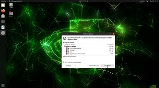

# Yolov8_JetsonNano
Install and Test of Yolov8 on Jetson Nano

<br>
<div style="text-align: center;">
  
</div>
<br>
Download <a href="https://github.com/Qengineering/Jetson-Nano-Ubuntu-20-image">Ubuntu 20.04 Image provided by Qenginieering</a> and burn on SD card via Balena Etcher, plug the card into the Jetson Nano, connect monitor, mouse and keyboard and boot the system.
<br>
<div style="text-align: center;">
  
</div>
<br>
<br>
Make sure that everything is updated to the latest.
<br>
<div style="text-align: center;">
  
</div>
<br>
<br>
The image is compacted, so the first action is expanding the partition to the maximum.<br>
After the boot, click on the lower left corner.
<br><br>
<div style="text-align: center;">
  
</div>
<br>
Type "disks" into the search field and click on the icon.
<br>
<div style="text-align: center;">
  
</div>
<br>
Click on the larger partition on the right and then on the right icon below the partitions.
<br>
<div style="text-align: center;">
  
</div>
<br>
Move the slider all the way to right to resize to the maximum. Hit the resize button top right.
<br>
<div style="text-align: center;">
  
</div>
<br>
Now the partition is maximized. Close the disks utility.
<br>
<div style="text-align: center;">
  
</div>
<br>
Open the terminal and first delete the swapfile, so the script can create a larger one.
<br>

```shell
sudo rm /var/swapfile
```
<br>
Download the script, make it executable and start it.
<br>

```shell
wget https://raw.githubusercontent.com/StefansAI/Yolov8_JetsonNano/main/scripts/yolov8_install.sh
chmod +x yolov8_install.sh
./yolov8_install.sh
```
<br>---------------------------------------------------------------------------------------------<br>
<br>
To test real-time detection from the camera device 0 (i.e. USB camera):
<br>

```shell
yolo task=detect mode=predict model=yolov8n.pt source=0 show=True
```
<br>
To test real-time segmentation from the camera device 0 (i.e. USB camera):
<br>

```shell
yolo task=segment mode=predict model=yolov8n-seg.pt source=0 show=True imgsz=320
```
<br>
To test real-time detection of the GardenCam model on the video clip.
<br>

```shell
cd ~/Downloads
wget https://github.com/StefansAI/Custom_Yolov8/raw/main/example/GardenCam640.pt
wget https://github.com/StefansAI/Custom_Yolov8/raw/main/example/GardenCam640.mp4
yolo task=detect mode=predict model=GardenCam640.pt source=GardenCam640.mp4 show=True
```

<br>
There are also smaller size models available for testing:
<br>

```shell
cd ~/Downloads
wget https://github.com/StefansAI/Custom_Yolov8/raw/main/example/GardenCam320.pt
wget https://github.com/StefansAI/Custom_Yolov8/raw/main/example/GardenCam320.mp4
yolo task=detect mode=predict model=GardenCam320.pt source=GardenCam320.mp4 show=True

wget https://github.com/StefansAI/Custom_Yolov8/raw/main/example/GardenCam224.pt
wget https://github.com/StefansAI/Custom_Yolov8/raw/main/example/GardenCam224.mp4
yolo task=detect mode=predict model=GardenCam224.pt source=GardenCam224.mp4 show=True
```

See how Jetson Nano compares to Raspberry Pi5: <a href="https://github.com/StefansAI/Yolov8_Rpi5_CoralUSB">Yolov8_Rpi5_CoralUSB</a>
