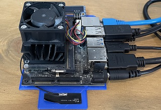
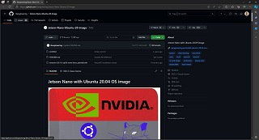
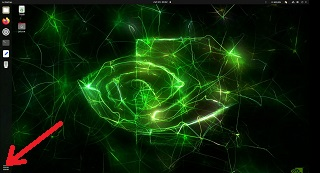
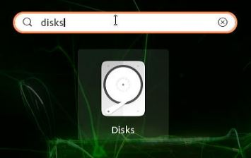
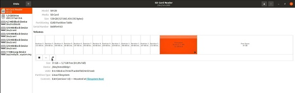
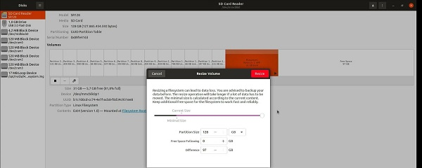
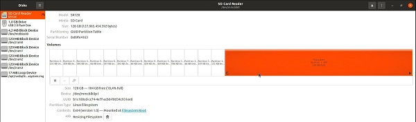

# Yolov8_JetsonNano
Install and Test of Yolov8 on Jetson Nano

<br>
<div style="text-align: center;">
  
</div>
<br>
Download <a href="https://github.com/Qengineering/Jetson-Nano-Ubuntu-20-image">Ubuntu 20.04 Image provided by Qenginieering</a> and burn on SD card via Balena Etcher, plug the card into the Jetson Nano, connect monitor, mouse and keyboard and boot the system.
<br>
<div style="text-align: center;">
  
</div>
<br>
<br>
The image is compacted, so the first action is expanding the partition to the maximum.<br>
After the boot, click on the lower left corner.
<br><br>
<div style="text-align: center;">
  
</div>
<br>
Type "disks" into the search field and click on the icon.
<br>
<div style="text-align: center;">
  
</div>
<br>
Click on the larger partition on the right and then on the right icon below the partitions.
<br>
<div style="text-align: center;">
  
</div>
<br>
Move the slider all the way to right to resize to the maximum. Hit the resize button top right.
<br>
<div style="text-align: center;">
  
</div>
<br>
Now the partition is maximized. Close the disks utility.
<br>
<div style="text-align: center;">
  
</div>
<br>
Open the terminal and first delete the swapfile, so the script can create a larger one.
<br>

```shell
sudo rm /var/swapfile
```

Download the script, make it executable and start it.
<br>

```shell
wget https://github.com/StefansAI/Yolov8_JetsonNano/tree/main/scripts/yolov8_install.sh
chmod +x yolov8_install.sh
./yolov8_install.sh
```


